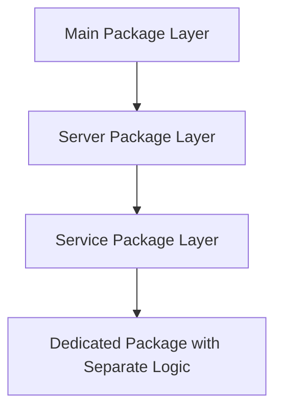

# Deck API

- [Deck API](#deck-api)
  - [Project Overview](#project-overview)
  - [Logic Separation](#logic-separation)
  - [Package Structure](#package-structure)
  - [Dependencies](#dependencies)
  - [Build and Run](#build-and-run)
  - [Principles for dealing with the development of this repository](#principles-for-dealing-with-the-development-of-this-repository)
  - [API Documentation](#api-documentation)

## Project Overview

This project provides a simple RESTful API for working with a deck of cards. The API allows users to create a deck, shuffle a deck, and draw cards from a deck.

The project is structured as follows:

```md
.
├── cmd
│ └── deck
│   └── main.go
├── docs
│ ├── docs.go
│ ├── swagger.json
│ └── swagger.yaml
├── pkg
│ ├── responses
│ │ └── deck_api_responses.go
│ ├── deck
│ │ ├── deck.go
│ │ ├── deck_test.go
│ │ ├── draw.go
│ │ ├── draw_test.go
│ │ ├── open.go
│ │ └── open_test.go
│ ├── server
│ │ ├── server.go
│ │ └── server_test.go
│ └── service
│   └── deck.go
├── go.mod
└── README.md
```

## Logic Separation



## Package Structure

- `cmd/deck`: This package contains the `main.go` file which is the entry point of the application. It initializes the necessary dependencies, creates an instance of the server, and starts the server to listen for incoming requests.

- `docs`: This package contains the documentation for the API, including the swagger.yaml and swagger.json files that describe the API endpoints and their parameters. The package also includes a docs.go file that can be used to serve the documentation as a web page.

- `pkg/responses`: This package contains response structs that are returned by the API endpoints. These structs are used to marshal responses in JSON format.

- `pkg/deck`: This package provides the core functionality for working with a deck of cards. It includes methods for creating a deck, shuffling a deck, and drawing cards from a deck. The package also includes corresponding test files.

- `pkg/server`: This package provides the server layer of the application. It includes the HTTP server initialization and routing definitions. The package also includes corresponding test files.

- `pkg/service`: This package provides the service layer of the application. It includes methods for extracting, processing, and validating URL parameters and request bodies. Once validated, requests are forwarded to the appropriate methods in separate packages.

## Dependencies

This project depends on the following external libraries:

- `gin-gonic/gin`: A popular HTTP router and dispatcher for building RESTful APIs.
- `stretchr/testify`: A testing toolkit for writing unit tests and assertions in Go.
- `google/uuid`: A package for generating and parsing UUIDs in Go.
- `gin-contrib/swagger`: A middleware for automatically generating RESTful API documentation with Swagger 2.0 for Gin web framework.

## Build and Run

- To build and run the project locally, use the following commands:

  - Build
    ```terminal
    go build ./cmd/deck
    ```
  - Run
    ```terminal
    ./deck
    ```

- To build and run the project locally, use the following commands:
  - Build
    ```terminal
    docker build -t deck-api .
    ```
  - Run
    ```terminal
    docker run -p 8080:8080 deck-api
    ```

---

## Principles for dealing with the development of this repository

1. Initialization of major dependencies should be performed in the main package. This ensures that the server is properly configured before it starts processing requests.
2. API routing should be carefully defined, including the endpoints that can be accessed within the server layer. Different group handlers should be registered to ensure that requests are properly handled and routed to the appropriate services.
3. The service layer should be responsible for extracting, processing, and validating URL parameters and request bodies. Once validated, requests should be forwarded to the appropriate methods in separate packages.
4. To handle incoming requests with validated parameters, an appropriate package should be built to process these requests efficiently and effectively.
5. Documentation should be maintained throughout the development process, including API documentation and code comments, to ensure that the application is understandable and maintainable.

## API Documentation

The API is documented using Swagger, which provides an interactive interface for exploring the API and its endpoints. The Swagger documentation is accessible at /docs. To view the documentation, navigate to http://localhost:8080/swagger/index.html in your web browser. The Swagger interface allows you to view the API specification, test endpoints, and experiment with different request and response payloads.
